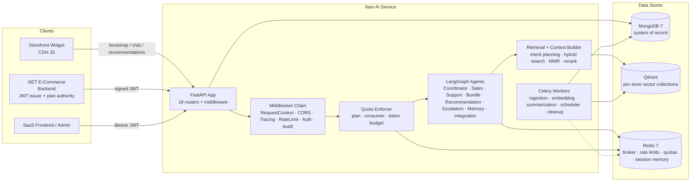
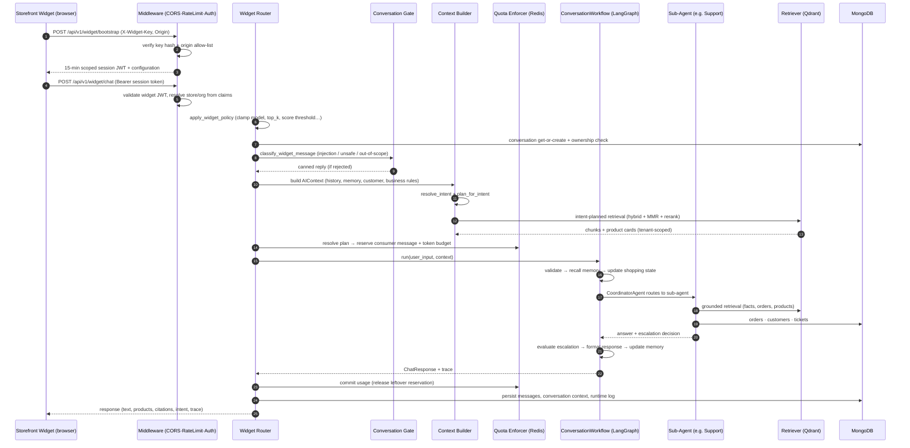
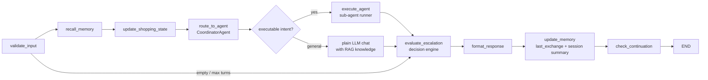
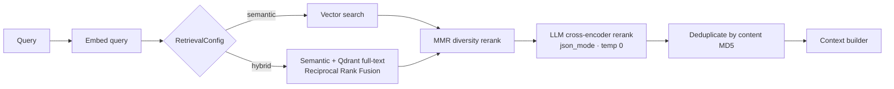
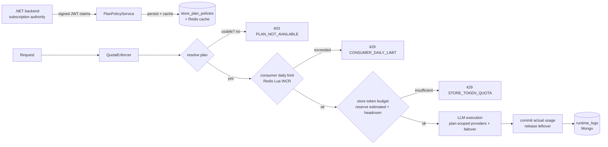
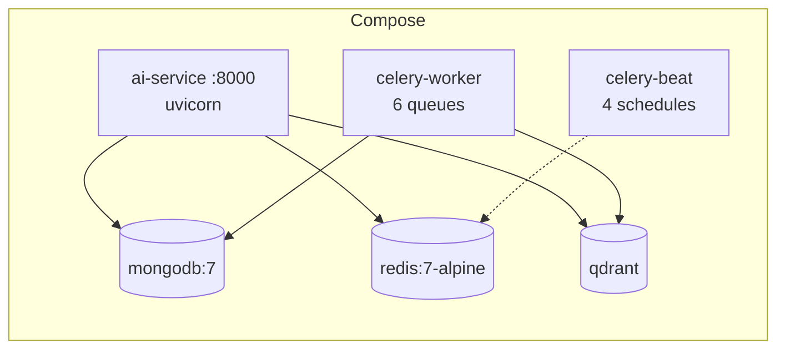

# Navi — AI Service

**Multi-provider AI orchestration, RAG, and agentic commerce platform.**

Navi is a tenant-aware AI backend for e-commerce stores. It powers a conversational storefront widget and SaaS APIs with intent-driven agent routing, grounded RAG answers over store knowledge bases, budget-aware bundle recommendations, support-ticket automation, and deep integration with third-party e-commerce platforms — all behind a plan-based quota system and strict tenant isolation.

> The service is a **JWT resource server**: it never issues SaaS credentials. It validates access tokens signed by the .NET e-commerce backend (shared secret, HS256) and issues its own short-lived, scoped tokens for the storefront widget.

---

## Table of Contents

- [Highlights](#highlights)
- [System Overview](#system-overview)
- [Tech Stack](#tech-stack)
- [Architecture](#architecture)
- [System Design](#system-design)
- [Sequence Diagram — Widget Chat Turn](#sequence-diagram--widget-chat-turn)
- [Codebase Layout](#codebase-layout)
- [AI Agents](#ai-agents)
- [Workflows](#workflows)
- [RAG Pipeline](#rag-pipeline)
- [Database Schema](#database-schema)
- [API Overview](#api-overview)
- [Quota & Plan System](#quota--plan-system)
- [Storefront Widget](#storefront-widget)
- [E-Commerce Integrations](#e-commerce-integrations)
- [Security](#security)
- [Observability](#observability)
- [Deployment](#deployment)
- [Configuration](#configuration)
- [Testing](#testing)
- [Local Development](#local-development)
- [Documentation Index](#documentation-index)
- [License](#license)

---

## Highlights

| Capability | What it does |
|---|---|
| **Agentic chat** | 8 LangGraph agents (coordinator, sales, support, recommendation, bundle, escalation, memory, integration) composed into a conversation workflow with deterministic routing, escalation, and memory |
| **Tenant-aware RAG** | Per-store Qdrant collections, hybrid search + MMR + LLM reranking, business summaries, commerce catalog indexing — 100% tenant-scoped by design |
| **10+ LLM providers** | OpenAI, Azure OpenAI, Gemini, Claude, Bedrock (via SBG gateway), DeepSeek, Mistral, Ollama, OpenRouter, Mock — with automatic failover, capability gating, and per-call instrumentation |
| **Plan-based quotas** | Redis atomic token budgets (Lua scripts), consumer daily limits, provider/model allowlisting per store plan — synced from the .NET backend, fail-closed |
| **Storefront widget** | CDN-loaded chat widget (`/widget/v1/widget.js`), scoped session tokens, origin allow-lists, prompt-injection gate, bilingual (EN/AR) guardrails |
| **Knowledge base** | Upload PDF/DOCX/TXT/CSV → extract → chunk (4 strategies) → embed → Qdrant, with versioning, async Celery jobs, and dead-letter recovery |
| **Commerce integration** | OpenAPI/Swagger-driven platform discovery: entity mapping to canonical schema, credential login, scheduled sync, and vectorization of synced products/orders |
| **Support automation** | Sentiment analysis, issue categorization, grounded answers, deterministic escalation with priority/tier/team assignment and customer notifications |
| **~2,000 tests** | Unit, integration, e2e, LLM evals, and widget JS tests across 9 suites |

---

## System Overview



---

## Tech Stack

| Layer | Choice |
|---|---|
| Language / runtime | Python ≥ 3.12, Node.js 20 (widget build tooling only) |
| Web framework | FastAPI + Uvicorn (ASGI) |
| LLM orchestration | LangGraph ≥ 1.2 (`StateGraph` agents & workflows) |
| Async jobs | Celery ≥ 5.4 + Redis broker, 6 queues, beat schedule |
| Primary database | MongoDB 7 via Motor (async driver) + Pydantic document models |
| Vector database | Qdrant (per-store collections, 768-dim, Cosine) |
| Cache / broker | Redis 7 (rate limits, quotas, session memory, CORS cache) |
| LLM providers | OpenAI, Azure OpenAI, Gemini, Claude, Bedrock, DeepSeek, Mistral, Ollama, OpenRouter, Mock |
| Embeddings | `gemini-embedding-001` (768-dim) |
| Config | Pydantic Settings + `python-dotenv` |
| Packaging | `uv` (lockfile) / setuptools; `pip install -e ".[dev]"` |
| Lint / type | Ruff (lint + format), Pyright |
| Tests | Pytest 8 (asyncio auto-mode), Node `node:test` + Puppeteer for the widget |
| Deployment | Docker Compose, Railway (Railpack), GitHub Actions CI |

---

## Architecture

The codebase follows a **modular monolith with DDD-flavored bounded contexts**, a **CQRS/mediator scaffolding layer**, and **LangGraph agent workflows** as the execution engine.

```mermaid
flowchart TB
    subgraph API["api/ — Presentation"]
        R1[chat · ai · widget · knowledge · rag<br/>commerce · recommendation · ticket · analytics<br/>integration · admin · auth · quota]
    end

    subgraph APP["application/ — Use Cases"]
        S1[services: chat · conversation · orchestration]
        S2[context: builder · intent resolver · retrieval planner · shopping state]
        S3[knowledge: chunking · processing · retrieval · generation · commands/queries]
        S4[quota: enforcer · provider selector · counter store · usage reporting]
        S5[integration: discovery · mapping · sync]
        S6[widget: token · bootstrap · installation · policy]
    end

    subgraph DOM["domain/ — Bounded Contexts"]
        D1[commerce · conversation · knowledge · ticket<br/>recommendation · analytics · customer · auth<br/>integration · job · memory · prompt · widget · marketing]
        D2[shared kernel: Entity · AggregateRoot · DomainEvent · AsyncRepository]
    end

    subgraph INF["infrastructure/"]
        I1[mongodb: client · documents · repositories · uow · indexes · validators]
        I2[qdrant provider · redis client · storage · gridfs mirror]
        I3[providers: 10 LLM adapters + factory]
        I4[http: ssrf · retry · pagination · auth handler]
        I5[security: AES-256-GCM encryption · key manager]
        I6[prompts: seeded prompt store · client]
        I7[events: in-memory bus · mediator container]
    end

    subgraph AG["agents/ — LangGraph"]
        A1[coordinator · sales · support · recommendation<br/>bundle · escalation · memory · integration]
    end

    subgraph WF["workflows/ — LangGraph + services"]
        W1[conversation · bundle · recommendation<br/>integration (sequential)]
    end

    subgraph WK["workers/ — Celery"]
        K1[ingestion · embedding · summarization · scheduler · cleanup]
    end

    API --> APP
    APP --> DOM
    APP --> INF
    AG --> APP
    WF --> AG
    WF --> APP
    WK --> INF
    INF --> DOM
```

**Key principles**

- **Tenant identity comes from validated JWT claims only.** Client-supplied `store_id` / `organization_id` in bodies and query strings are never trusted — mismatches return 403, and every read path is fail-closed with ownership assertions.
- **Determinism over LLM.** Intent routing, recommendation ranking, inventory/budget filtering, bundle scoring, escalation decisions, priority/team assignment, and capability detection are deterministic. LLMs parse intent, extract needs, and write humanized copy — grounded in verified facts and guarded against prompt injection.
- **One choke point for LLM calls.** The provider factory wraps every adapter in `_InstrumentedProvider`, emitting structured `llm.call` / `llm.stream.complete` / `llm.error` flow events with request ID, latency, and token usage.
- **Fail-closed by default.** Quota enforcement (503 on Redis outage unless `QUOTA_FAIL_OPEN=true`), plan usability, ownership checks, CORS origin resolution, and provider credential validation all fail safe.

---

## System Design

### Middleware chain (outermost → innermost)

| # | Middleware | Responsibility |
|---|---|---|
| 1 | `RequestContextMiddleware` | Correlation ID (`X-Request-ID` / `X-Correlation-ID`) via ContextVar, echoed on response |
| 2 | `WidgetCorsMiddleware` | Per-installation origin allow-list for `/api/v1/widget/*` (never wildcard), cached 60 s, fail-closed |
| 3 | `AITracingMiddleware` | Request success/failure logging, latency, `X-Process-Time-Ms` |
| 4 | `RateLimitMiddleware` | 4 endpoint-aware tiers (general 100/min, LLM 20/min, widget bootstrap 30/min, widget session 60/min), Redis fixed window + in-memory fallback, `X-RateLimit-*` headers |
| 5 | `AuthMiddleware` | JWT validation, issuer dispatch (SaaS vs widget), whitelist, plan-claim sync |
| 6 | `AuditMiddleware` | One audit log per non-GET request (action, actor, outcome, duration) |
| 7 | `CORSMiddleware` | Static origin allow-list |

### Key subsystems

| Subsystem | Design |
|---|---|
| **Providers** | `BaseLLMProvider` interface (`chat`, `stream`, `embeddings`, `structured_output`, `tool_call`, `health_check`) + `LLMProviderFactory` singleton with per-provider instance cache and instrumentation |
| **Model registry** | ~40 models across 8 providers with capabilities (vision, JSON mode, tool calling, streaming, embedding), context length, and pricing per 1M tokens |
| **Context builder** | Per-request assembly: history → memory → customer → business rules → **intent resolution** → intent-specific retrieval plan (`RetrievalPlan` maps intent → entity types, top_k, hybrid/MMR/rerank) |
| **Shopping state** | Session-scoped requirement accumulator (intent, category, budget, currency, color, size, brand, use case) — merged incrementally each turn, persisted as session memory, category changes reset dependent fields |
| **Escalation engine** | Deterministic decision matrix (explicit human request, business rule, repeated failure, strong frustration, knowledge unavailable) → ticket creation → EscalationAgent handoff |
| **CQRS / mediator** | `Command`/`Query` + `Mediator` with pipeline behaviors (logging, validation, unit-of-work, event publisher); used in production by the knowledge commands/queries (upload, business-summary generation) |
| **Prompt store** | MongoDB `prompts` collection seeded at startup; every system/agent prompt is runtime-editable via admin API (`/api/v1/admin/prompts`) |

---

## Sequence Diagram — Widget Chat Turn



---

## Codebase Layout

```
ai-service/
├── app/
│   ├── main.py                  # FastAPI bootstrap, middleware, routers
│   ├── api/                     # Presentation: feature routers, schemas, dependencies
│   ├── application/             # Use cases: services, context, quota, knowledge, integration, widget
│   ├── domain/                  # DDD bounded contexts: entities, aggregates, value objects,
│   │                            #   repositories (ports), events, exceptions
│   ├── infrastructure/          # Adapters: mongodb, qdrant, redis, providers, http, storage,
│   │                            #   security, prompts, events, mediator, tasks
│   ├── agents/                  # LangGraph agents (agent.py / nodes.py / state.py / tools.py)
│   ├── workflows/               # LangGraph workflows: conversation, bundle, recommendation
│   │                            #   + integration (sequential service)
│   ├── workers/                 # Celery tasks: ingestion, embedding, summarization,
│   │                            #   scheduler, cleanup
│   ├── middleware/              # request_context, widget_cors, logging, rate_limit, auth, audit
│   ├── shared/                  # kernel (Entity/AggregateRoot), cqrs, mediator, events, pagination
│   ├── core/                    # settings, exceptions, security, model registry, contexts
│   ├── static/widget/           # CDN widget artifacts (built with esbuild, committed)
│   └── utils/                   # ai_error_handler, content_guard, token_utils
├── tests/                       # unit (1827) · integration (92) · e2e (53) · eval (23) · widget (28)
├── scripts/                     # seeders, migrations, reindex, e2e flows, RAG playground
├── docs/                        # architecture, agents, rag, database, security, deployment
├── resources/                   # store fixtures, test PDFs
├── Dockerfile                   # single-stage python:3.12-slim build
├── docker-compose.yml           # 6 services: api, 2×celery, mongodb, redis, qdrant
├── pyproject.toml               # deps, pytest/ruff config
├── Makefile                     # dev, test, lint, typecheck, docker targets
└── package.json                 # widget build tooling (esbuild, puppeteer)
```

---

## AI Agents

All agents follow a uniform 4-file convention (`agent.py` LangGraph graph · `nodes.py` · `state.py` · `tools.py`) and share a runner contract: `(query, store_id, customer_id, history, conversation_id, context)`.

| Agent | Purpose | Routing / decisions |
|---|---|---|
| **Coordinator** | Routes every request to the right sub-agent via intent classification. Never answers directly. | `extract_context → classify_intent → route_to_agent → execute_sub_agent / handle_fallback → format_response`. Reuses the context builder's intent — never re-classifies. |
| **Sales** | Conversational funnel: discovery → qualification → recommendation → objection handling → close, with promo codes. | Stage machine (`SalesState.stage`); asks clarifying questions until enough info; delegates recommendations to the Recommendation workflow; real promo codes via `PromoCodeService` when the store supports them. |
| **Support** | Grounded customer support: verify customer → categorize issue → retrieve facts → resolve order/refund issues → escalate as last resort → feedback → grounded reply. | Deterministic refund-policy evaluation, topic detection, product/order resolution; escalation via the decision engine; replies grounded in verified facts guarded against injection. |
| **Recommendation** | Deterministic product recommendation with spec matching. | Parse intent → catalog search (vector fuzzy fallback) → inventory + budget filtering → deterministic ranking → explanation. LLM only parses intent and writes the explanation. |
| **Bundle** | Budget-aware bundle deals. | Parse budget → find candidates → **knapsack enumeration** (1–3 items, ≤400 combos) → score against budget with max discount → top-3 selection → optional real promo code. |
| **Escalation** | Human handoff: summarize → priority (P1–P4) → team assignment → ticket creation → customer notification → handoff message. | Fully linear; priority matrix from customer tier; `account_security` always P1. |
| **Memory** | Layered memory: session-scoped (Redis hash, 24 h TTL) and user-scoped (Mongo `user_memories`, TTL-aware). | `store / recall / forget / summarize` single-node dispatch. Recall precedence: session → user → store defaults. |
| **Integration** | Analyzes an uploaded OpenAPI/Swagger spec of an external e-commerce platform. | Parse → LLM entity/field-mapping report (with validation retries) → deterministic capability detection → feature-gap analysis. |

**Intent vocabulary:** `sales, support, bundle, recommendation, product_information, marketing, analytics, escalation, integration, general` — with `EXECUTABLE = {bundle, recommendation, sales, support, product_information}`, `COMING_SOON = {marketing, analytics}`, and `escalation` normalized to `support` at the routing layer.

---

## Workflows

### Conversation workflow (the top-level orchestrator)



9 nodes, max 4 turns per request, context window 20 messages. Sub-agent answers flow through an escalation re-check even on success; the final response carries intent, trace, escalation metadata, and message ID.

### Domain workflows

| Workflow | Shape |
|---|---|
| **Bundle** (`workflows/bundle`) | Thin LangGraph wrapper over `BundleSuggestionAgent`; persists the winning bundle as a `BundleSuggestion`. |
| **Recommendation** (`workflows/recommendation`) | Thin LangGraph wrapper over `RecommendationAgent`; merges recalled shopping state so multi-turn constraints reach the agent. Also invoked internally by the Sales agent. |
| **Integration** (`workflows/integration`) | Sequential service: agent analysis → connection creation (auth inferred from spec, credentials encrypted, ACTIVE/INACTIVE status) → optional immediate sync via `SyncOrchestrator`. |

---

## RAG Pipeline

### Ingestion

```mermaid
flowchart LR
    U[Upload<br/>PDF · DOCX · TXT · CSV] --> V{validate + dedupe}
    V -- checksum + store_id --> S[Storage<br/>local disk + GridFS mirror]
    S --> X[Extract<br/>pdfminer · python-docx · chardet]
    X --> P[Process<br/>normalize · strip HTML · language detect · stats]
    P --> C[Chunk<br/>recursive · sentence · token · markdown]
    C --> E[Embed<br/>gemini-embedding-001 · 768-dim · batches of 50]
    E --> Q[(Qdrant<br/>collection kb_{store})]
    C --> V2[Versioning<br/>knowledge_versions · document versions]
```

- Uploads are **deduplicated per tenant** by `(checksum, store_id)`; re-uploads bump the document version, delete stale chunks/vectors, and re-enqueue processing.
- Every step runs as a **job-tracked Celery task** (`knowledge.process_document` → `generate_chunks` → `generate_embeddings` → `sync_vectors`) with dead-letter handling, retries, and a requeue API.
- Files are mirrored to GridFS so worker containers (which share only MongoDB) can materialize them.
- **Commerce indexing** (`StoreIndexer` / `kb.backfill_store_vectors`): products, categories, and orders are formatted, embedded, and upserted into the same per-store collection as knowledge chunks — enabling product-card retrieval.
- Documents containing instructional content are flagged (`injection_flagged`) as a poisoning guard.

### Retrieval



- **Tenant enforcement first**: when a `TenantContext` is bound, `organization_id`, `store_id`, and `knowledge_version` from the tenant always override caller filters.
- **Business summaries**: LLM-generated 8-section store context (overview, policies, FAQs, shipping, refund, service guidelines, tone, brand) injected version-tagged into the RAG system prompt.
- **Citations**: `[citation: N]` markers parsed from the LLM output and mapped to chunks; failed LLM calls fall back to verbatim retrieved chunks with all citations.
- **Confidence**: `0.3 + 0.7 × avg(top-5 score)` (0.2 + 0.8× without summary), clamped 0–1; below 0.3 with a human-request signal → automatic ticket creation.
- **Intent-aware planning** (widget path): support/policy intents retrieve knowledge at top_k 6; recommendation/sales/product intents retrieve products at top_k 10 (MMR off — diversity hurts exact-product queries); unknown intents fall back to safe support knowledge, never unfiltered retrieval.

---

## Database Schema

### MongoDB — system of record (30 collections)

| Collection | Purpose | Notable indexes |
|---|---|---|
| `conversations` / `messages` | Chat transcripts + messages with sentiment/intent enrichment | `(store_id, customer_id)`, `(conversation_id, timestamp)` |
| `knowledge_documents` | Uploaded KB documents with version history | `store_id`, `status`, title text index |
| `knowledge_chunks` | Chunked text fragments linked to Qdrant points | `(document_id, chunk_index)` unique, `embedding_id` sparse |
| `knowledge_versions` | Tenant KB version snapshots (document/chunk counts, status) | `(store_id, version_number)` |
| `knowledge_business_summaries` | LLM-generated store business context, versioned | `(document_id, version_number)`, `created_at` |
| `knowledge_uploads` | File upload tracking, per-tenant dedup, virus-scan status | `(checksum, store_id)` unique |
| `knowledge_jobs` | Async job tracking (progress, retries, dead-letter) | `(status, job_type)`, `celery_task_id` sparse |
| `products` | Commerce catalog mirror with AI extensions (discounts, promos) | `(organization_id, store_id, external_id)` unique, title text |
| `categories` / `orders` / `inventory` / `customers` | Commerce data for AI context | `(store_id, external_id)` unique, `(store_id, variant_id)` unique |
| `recommendations` / `bundle_suggestions` | Recommendation + bundle records with acceptance | `conversation_id`, `created_at` |
| `ticket_analysis` / `ticket_notifications` | Support tickets (sentiment, category, priority) + customer notifications | `ticket_id` unique, `(store_id, status)` |
| `integration_connections` / `entities` | Platform integrations (encrypted credentials, mappings) + synced raw entities | `(store_id, name)` unique, `store_id` |
| `prompts` | Runtime-editable prompt registry (seeded at startup) | `key` unique |
| `user_memories` | Durable cross-session memory with TTL | `user_id`, `store_id`, `expires_at` |
| `widget_installations` | Widget installs: public-key hash, origins, scopes | `public_key_hash` / `widget_id` unique |
| `store_plan_policies` | Per-store quota plan (synced from .NET claims) | `store_id` unique |
| `store_capabilities` | Detected store features (e.g. promo-code support) | `store_id` unique |
| `runtime_logs` | AI usage/billing logs | `timestamp` TTL 30 days, `(store_id, billing_period)` |
| `prompt_history` | Full prompt/response traces | `timestamp` TTL 30 days |
| `audit_logs` | Security/compliance audit trail | `timestamp` DESC, `(tenant_id, timestamp)` |
| `bundle_tracking` / `bundle_events` | Bundle promo funnel analytics | `(store_id, bundle_key)` unique |
| `dashboard_insights` | Revenue/insight aggregates (hourly commerce sync) | — |
| `api_keys` | Server-to-server keys (SHA-256 hashed) | `key_hash` / `key_prefix` unique |

All writes go through a generic `BaseMongoRepository` (domain-event flushing, duplicate-key → `ConcurrencyException`, transaction-capable), 22 collections carry `$jsonSchema` validators, and MongoDB transactions are available via `MongoUnitOfWork`.

### Qdrant — vector store

| Aspect | Value |
|---|---|
| Collections | One per store: `kb_{store_id}` (or `kb_{vector_namespace}`) |
| Vectors | 768-dim, Cosine distance, HNSW (ef=128) |
| Payload | `store_id`, `organization_id`, `entity_type` (product/knowledge/category/policy/faq/review/order), `source_type`, `document_status`; products add `price`/`currency`/`specs`; chunks add `document_id`/`chunk_id`/`knowledge_version`/`language`/`content` |
| Partitioning | Collection-per-store **and** payload-level tenant filters, enforced at the retriever level |

### Redis

| Role | Detail |
|---|---|
| Celery broker/backend | JSON serialization, `acks_late`, 6 queues |
| Rate limiting | Fixed-window counters per tier |
| Quota accounting | Atomic Lua scripts: token reserve/commit/release, consumer daily counters |
| Session memory | `session:{id}:memory` hashes (shopping state, last exchange), 24 h TTL |
| Plan policy cache | `plan:policy:{store_id}` (TTL 300 s) |
| Widget origin cache | Allowed-origin allow-list (TTL 60 s) |

---

## API Overview

All routes except the widget and static assets require a Bearer JWT; admin routes require exact role matches (`admin`, `super_admin`), and store analytics explicitly rejects `super_admin`.

| Module | Prefix | Highlights |
|---|---|---|
| AI | `/api/v1/ai` | `chat`, `chat/stream` (SSE), `chat/structured`, `chat/tools`, `embeddings`, `models`, `providers`, provider health |
| Chat | `/chat` | Single-message chat |
| Widget | `/api/v1/widget` | `bootstrap`, `chat`, `recommendations`, `bundles/events` + admin installs at `/api/v1/admin/widget-installations` |
| Knowledge | `/api/v1/knowledge-base`, `/knowledge/jobs`, `/knowledge/retrieval` | Upload, async process/chunk/embed jobs, search (semantic/hybrid), business summaries, store reindex, dead-letter requeue |
| Commerce | `/api/v1/commerce` | Products, categories, orders, inventory CRUD (admin) |
| Recommendations | `/api/v1/recommendations` | `chat`, `bundle-suggestion` |
| Tickets | `/api/v1/tickets` | Full lifecycle: create, escalate, resolve, messages, notifications, metrics |
| Analytics | `/api/v1/analytics` | Sentiment summary, AI usage report, consumer-limit write-through to .NET, plan proxy |
| Admin | `/api/v1/admin` | Bundles tracking/promotion, cross-store sentiment, **prompt store CRUD + seed/restore** |
| Integration | `/api/v1/integration` | Spec parse (deterministic + agentic), connections, sync, mappings, credentials |
| Auth | `/api/v1/auth` | Audit-log listing (super-admin) |
| Public | `/health/`, `/widget.js`, `/widget/v1/widget.js`, `/demo`, `/widget/test-store` | Health + widget CDN assets |

**Job pattern:** heavy operations return `202 Accepted` with `{job_id, job_type, status}` and are polled via `GET /knowledge/jobs/{job_id}` (store-scoped).

---

## Quota & Plan System



- **Provider selection**: the requested model is honored only if the plan allows it; otherwise plan fallback → first allowed model. **The client can never override the plan.**
- **Failover**: across plan-allowed providers on unavailability/rate-limit/auth errors, aggregated into a `QuotaRunState` for accurate multi-call accounting.
- **Fail-closed**: Redis outage → `503 QUOTA_UNAVAILABLE` (never silently unlimited) unless the operator opts into `QUOTA_FAIL_OPEN=true`.
- The .NET backend remains the source of truth for subscription state; the service degrades to its locally persisted plan policy when .NET is unreachable (surfaced as `source: net|local`).

---

## Storefront Widget

A CDN-distributed chat widget whose artifacts are committed to `app/static/widget/dist` and served by FastAPI.

| Aspect | Detail |
|---|---|
| Install | One-line snippet: `<script src="{origin}/widget/v1/widget.js" data-widget-key="...">` |
| Provisioning | `POST /api/v1/admin/widget-installations` issues a `wi_…` key (only its SHA-256 hash is stored) + origin allow-list + scopes |
| Bootstrap | `X-Widget-Key` + `Origin` → 15-min scoped session JWT (issuer `AI-Commerce-Widget`); generic errors prevent key enumeration |
| Scopes | `rag:chat`, `recommendations:read` enforced per endpoint |
| Guardrails | Deterministic bilingual (EN/AR) message gate (injection / unsafe / out-of-scope / greetings), internal-label scrubbing of assistant output, policy clamping of every client AI knob |
| Streaming | SSE chat (`/api/v1/ai/chat/stream`) with Bedrock support via single-shot JSON (streaming-only providers) |
| Analytics | Funnel events: `bundle_shown` → `promo_displayed` → `bundle_clicked` → `promo_copied` → `promo_applied` |

---

## E-Commerce Integrations

The service can connect to arbitrary e-commerce platforms exposed via OpenAPI/Swagger:

1. **Discovery** — upload the platform spec; the Integration agent produces an `IntegrationMappingReport` (24 canonical entity types, CRUD endpoints, pagination, auth scheme, field mappings with transformer hints, feature-gap analysis).
2. **Connection** — auth inferred from the spec's `securitySchemes`; optional login with store-admin credentials (from JWT claims, ephemeral, never persisted); credentials encrypted with AES-256-GCM.
3. **Sync** — scheduled (weekly full sync, hourly inventory/orders) or on-demand; records normalized to canonical schema and **bridged into the RAG store** so synced products/orders become AI-queryable.

---

## Security

| Area | Controls |
|---|---|
| **Authentication** | Two token families by issuer: SaaS access tokens (HS256, shared secret with .NET, issuer/audience enforced, zero clock skew, `security_stamp` required) and local widget tokens (15-min TTL, scoped). `JWT_SECRET` ≥ 32 chars enforced. |
| **Tenant isolation** | Store/org identity from validated claims only; client-supplied IDs rejected (403); ownership asserted at handler level everywhere; tenant override at the retriever; collection-per-store in Qdrant. |
| **RBAC** | Exact role matching (`admin` / `super_admin`), permission claims (`Stores.Read`, `Subscriptions.Manage`, …) with super-admin bypass; separate widget scope system. |
| **Prompt injection** | Request-side deterministic classifier (EN/AR) + RAG-side `guard_facts` poisoning scanner + output-side internal-label scrubbing. |
| **SSRF** | URL scheme/IP allow-list, DNS re-resolution against all resolved addresses, per-request httpx hook. |
| **LFI** | Path validation: no `..` segments, no URL schemes, allow-listed extensions, `realpath` inside allowed roots. |
| **Secrets** | AES-256-GCM encryption (random nonce), key from `ENCRYPTION_KEY` or derived from `JWT_SECRET`; provider keys env-only, fail loudly if missing; widget keys stored hashed. |
| **Rate limiting** | 4 tiers, Redis fixed window + bounded in-memory fallback, `X-RateLimit-*` headers, `Retry-After`. |
| **Audit** | One audit log per non-GET request with actor, action, resource, outcome, duration; readable only by super-admins. |
| **Quota** | Fail-closed plan/token/consumer enforcement (§ Quota & Plan System). |

---

## Observability

| Channel | Detail |
|---|---|
| Health | `GET /health/` |
| AI flow events | Structured `llm.call` / `llm.error` / `llm.stream.complete` per request ID (`ai.flow` logger) |
| Request tracing | Correlation IDs propagated through the whole stack via ContextVar |
| Usage accounting | `runtime_logs` (30-day TTL) + `prompt_history` traces for cost/usage analytics |
| Admin analytics | Cross-store sentiment overview, per-store bundle funnel, AI usage reports |
| Audit | Immutable request audit trail in MongoDB |

---

## Deployment

### Docker Compose (local / self-hosted)



```bash
cp .env.example .env   # fill provider keys + JWT_SECRET (shared with .NET backend)
make docker-up         # or: docker compose up --build
```

Beat schedule: retry failed jobs every 15 min · dead-letter cleanup daily 03:00 · weekly integration sync (Sunday 00:00) · hourly commerce sync.

### Railway

The repo is deployed to Railway via Railpack (`railpack.json` → project `ai-service`), with MongoDB, Redis, and Qdrant provisioned as Railway services and an `up.railway.app` domain for the widget CDN.

### CI (GitHub Actions)

Three jobs on push/PR to `main`:

| Job | Steps |
|---|---|
| `lint` | Ruff check + format check |
| `test` | Mongo 7 + Redis 7 services, `pip install -e ".[dev]"`, unit suite with coverage → Codecov |
| `docker` | Image build |

### Production guidance

- **Sizing**: AI service 4 vCPU / 8 GB+; MongoDB 4+ / 8 GB+ SSD; Qdrant 4+ / 8 GB+ SSD; Redis 2+ / 4 GB+.
- **Scaling**: horizontal API replicas (stateless), scale Celery queues independently, Qdrant Cloud / Atlas for managed storage.
- **Backups**: `mongodump`, Qdrant snapshots, Redis RDB/AOF.
- **Rollback**: pinned images + OpenAPI baseline diff; no app-phase schema migrations.
- Widget E2E acceptance runs against the production Railway URL (`E2E_BASE_URL`).

---

## Configuration

Key environment variables (full list in `ai-service/.env.example`):

| Variable | Default | Purpose |
|---|---|---|
| `JWT_SECRET` | — | HS256 secret shared with .NET backend (≥ 32 chars; `JWT_SECRET_KEY` legacy fallback) |
| `OPENAI_API_KEY` · `GEMINI_API_KEY` · `ANTHROPIC_API_KEY` · `DEEPSEEK_API_KEY` · `MISTRAL_API_KEY` · `OPENROUTER_API_KEY` · `AZURE_OPENAI_KEY` · `SBG_API_KEY` | — | Provider credentials (fail loudly if missing) |
| `DEFAULT_PROVIDER` / `DEFAULT_MODEL` | `openai` / `gpt-4o-mini` | Default chat model |
| `MONGO_URI` / `MONGO_DB` | — / `ai_commerce` | MongoDB connection |
| `QDRANT_URL` | — | Qdrant endpoint |
| `REDIS_URL` | — | Redis (broker, rate limits, quotas) |
| `RATE_LIMIT_PER_MINUTE` / `RATE_LIMIT_LLM_PER_MINUTE` / `RATE_LIMIT_WIDGET_BOOTSTRAP_PER_MINUTE` / `RATE_LIMIT_WIDGET_SESSION_PER_MINUTE` | 100 / 20 / 30 / 60 | Rate-limit tiers |
| `ENCRYPTION_KEY` | — | AES-256-GCM key for integration credentials |
| `RAG_LLM_PROVIDER` / `RAG_LLM_MODEL` / `RAG_EMBEDDING_MODEL` | `gemini` / `gemini-2.5-flash` / `gemini-embedding-001` | RAG pipeline models |
| `QUOTA_FAIL_OPEN` | `false` | Allow quota bypass on Redis outage (operator override) |
| `JWT_REQUIRED` | `false` | Require tokens on all routes (public-mode toggle) |
| `PROMO_CODES_ENABLED` | `true` | Bundle/sales promo-code generation |

---

## Testing

```bash
make test            # full unit suite + coverage
make test-integration
make test-e2e
make eval            # LLM evals (needs provider keys; OpenRouter default)
npm run test:widget  # widget JS unit tests (esbuild + node:test)
npm run test:widget:e2e  # widget acceptance against the deployed URL (puppeteer)
```

| Suite | Count | Notes |
|---|---|---|
| Unit | 1,827 | Providers, knowledge, widget, agents, quota, security, middleware, workflows, CQRS |
| Integration | 92 | API + Mongo repositories against real Mongo/Redis |
| E2E | 53 | Full store-owner/consumer chains with mocked external infra |
| Eval | 23 | Real-LLM evals: bundles, customer service, escalation, memory, recommendations, security |
| Widget JS | 28 | Runtime, loader, and Puppeteer acceptance |

---

## Local Development

```bash
cd ai-service
python -m venv .venv && source .venv/bin/activate
pip install -e ".[dev]"

docker compose up -d mongodb redis qdrant   # infra only

make dev                                     # uvicorn :8000 --reload
make lint                                    # ruff check + format
make typecheck                               # pyright
```

Useful scripts (`ai-service/scripts/`): `seed_all_data.py`, `seed_2_tenants.py`, `seed_prompts.py`, `backfill_all_stores.py`, `reindex.py`, `migrate_atlas.py`, `e2e_full_user_flow.py`, `rag_playground.py`, `build-widget.mjs` (widget bundle).

---

## Documentation Index

| Document | Scope |
|---|---|
| `ai-service/docs/ARCHITECTURE.md` | Tenant-aware RAG extension deep dive |
| `ai-service/docs/agents.md` | LangGraph agent conventions + adding agents |
| `ai-service/docs/rag.md` | RAG pipeline components and phases |
| `ai-service/docs/database.md` | Database design notes |
| `ai-service/docs/security.md` | Auth, encryption, rate limiting, tenant isolation |
| `ai-service/docs/deployment.md` | Deployment, scaling, monitoring, backups, rollback |
| `docs/CLASS_DIAGRAM.md` · `class-diagram.svg` | Class-level design |
| `docs/PHASE1_IMPLEMENTATION_REPORT.md` | Product discovery remediation report |
| `docs/WIDGET_*.md` | Widget integration guides (Angular, Vercel), endpoint matrix, audits |
| `docs/KNOWLEDGE_TENANT_DATA_AUDIT.md` | Tenant data isolation audit |
| `openapi-1.yaml` | Upstream .NET e-commerce API spec (integration reference) |

---

## License

[MIT](LICENSE)