# AiCommerce AI Service — Class Diagram

```mermaid
classDiagram
    direction LR

    %% ===================== LAYER 1 — API =====================
    class FastAPIApp {
        +include_router()
        +add_middleware()
        +add_exception_handler()
    }
    class ChatRouter
    class AIRouter
    class WidgetRouter
    class TicketRouter
    class AdminPromptRouter
    class CommerceRouter
    class KnowledgeRouter
    class RecommendationRouter
    class IntegrationRouter
    class AuthRouter
    class AnalyticsRouter
    class RequestContextMiddleware {
        +request_id
    }
    class WidgetCorsMiddleware
    class AITracingMiddleware
    class RateLimitMiddleware {
        +per-tier limits
    }
    class AuthMiddleware {
        +JWT validation
        +widget token path
    }
    class AuditMiddleware

    %% ===================== LAYER 2 — ORCHESTRATION =====================
    class ConversationWorkflow {
        +validate_input_node
        +recall_memory_node
        +update_shopping_state_node
        +route_to_agent_node
        +execute_agent_node
        +evaluate_escalation_node
        +format_response_node
        +update_memory_node
        +check_continuation_node
        +run()
    }
    class ConversationWorkflowState {
        +user_input: str
        +messages: list
        +store_id: str
        +conversation_id: str
        +context: dict
    }
    class OrchestrationService {
        +chat()
        +_build_workflow()
        +sales_runner
    }
    class ChatService {
        +chat()
        +stream()
        +structured_output()
        +tool_call()
        +inject_history: bool
    }
    class ConversationService {
        +get_conversation_history()
        +save_interaction()
    }

    %% ===================== LAYER 3 — AGENTS =====================
    class CoordinatorAgent {
        +classify_intent()
    }
    class SalesAgent {
        +generate_promo_code()
        +handle_objection()
    }
    class SupportAgent {
        +categorize()
        +answer_grounded()
    }
    class EscalationAgent {
        +summarize()
        +notify_team()
    }
    class MemoryAgent {
        +recall()
        +summarize_session()
        +extract_shopping_state()
    }
    class BundleAgent
    class RecommendationAgent {
        +parse_intent
        +search_candidates
        +filter_inventory
        +rank_candidates
        +format_response
    }
    class IntegrationAgent {
        +analyze_spec()
        +detect_feature_gap()
        +explain_error()
    }

    %% ===================== LAYER 4 — APPLICATION SERVICES =====================
    class RAGService {
        +answer()
        +answer_stream()
        +_prepare_context()
    }
    class PromptService {
        +seed_defaults()
        +write ops invalidate cache
    }
    class PromptClient {
        +get(key) -> prompt
        +fallback: DEFAULT_PROMPTS
    }
    class RecommendationService
    class BundleSuggestionService {
        +suggest()
        +_persist_top_bundle()
    }
    class PromoCodeService {
        +generate_code()
        +gated by store capabilities
    }
    class TicketService {
        +create_ticket()
        +resolve_ticket()
        +escalate_ticket()
    }
    class SentimentService {
        +analyze()
    }
    class WidgetBootstrapService {
        +bootstrap(x_widget_key, origin)
    }
    class KnowledgeGenerationService
    class RetrieverService {
        +retrieve()
        +knowledge_version filter
    }

    %% ===================== LAYER 5 — INFRASTRUCTURE =====================
    class LLMProviderFactory {
        +get_provider(name)
        +fallback chain
    }
    class BaseLLMProvider {
        +chat()
        +stream()
        +embeddings()
        +structured_output()
        +tool_call()
    }
    class OpenAIProvider
    class AzureOpenAIProvider
    class GeminiProvider
    class ClaudeProvider
    class DeepSeekProvider
    class MistralProvider
    class OpenRouterProvider
    class MongoClientManager {
        +get_database()
    }
    class QdrantProvider {
        +upsert()
        +search()
        +collection_exists()
    }
    class ProductRepository
    class TicketRepository
    class RecommendationRepository
    class KnowledgeRepository
    class StoreCapabilitiesRepository {
        +get_or_detect()
    }
    class CeleryWorkers {
        +ingestion tasks
        +embedding tasks
        +summarization tasks
    }

    %% ===================== LAYER 6 — DOMAIN =====================
    class Product {
        +store_id
        +variants
        +price
        +metadata.max_discount_pct
    }
    class Variant {
        +sku
        +price: Money
        +inventory_quantity
    }
    class Money {
        +amount: Decimal
        +currency
    }
    class TicketAnalysis {
        +ticket_id
        +store_id
        +status
        +priority
    }
    class BundleSuggestion {
        +store_id
        +bundle
        +rank
    }
    class TenantContext {
        +organization_id
        +store_id
        +knowledge_version
    }
    class AuthenticatedUser {
        +user_id
        +store_id
        +roles
        +permissions
    }
    class AIException {
        +message
        +status_code
    }
    class ProviderUnavailableException
    class RateLimitException
    class AllProvidersFailedException
    class StoreTokenQuotaExceededException
    class DomainException
    class InfrastructureException

    %% ===================== RELATIONSHIPS =====================

    %% API layer
    FastAPIApp "1" --> "*" ChatRouter
    FastAPIApp "1" --> "*" AIRouter
    FastAPIApp "1" --> "*" WidgetRouter
    FastAPIApp "1" --> "*" TicketRouter
    FastAPIApp "1" --> "*" AdminPromptRouter
    FastAPIApp "1" --> "*" CommerceRouter
    FastAPIApp "1" --> "*" KnowledgeRouter
    FastAPIApp "1" --> "*" RecommendationRouter
    FastAPIApp "1" --> "*" IntegrationRouter
    FastAPIApp "1" --> "*" AuthRouter
    FastAPIApp "1" --> "*" AnalyticsRouter
    FastAPIApp "1" *--> "*" AuthMiddleware
    FastAPIApp "1" *--> "*" RateLimitMiddleware
    FastAPIApp "1" *--> "*" AuditMiddleware
    FastAPIApp "1" *--> "*" AITracingMiddleware
    FastAPIApp "1" *--> "*" RequestContextMiddleware
    FastAPIApp "1" *--> "*" WidgetCorsMiddleware

    %% Orchestration
    ConversationWorkflow "1" *-- "1" ConversationWorkflowState
    OrchestrationService "1" --> "1" ConversationWorkflow : builds
    ChatService "1" --> "1" OrchestrationService : delegates when set
    ChatService "1" --> "1" ConversationService
    OrchestrationService "1" --> "1" ConversationService
    OrchestrationService "1" --> "*" CoordinatorAgent
    OrchestrationService "1" --> "*" SalesAgent
    OrchestrationService "1" --> "*" SupportAgent
    OrchestrationService "1" --> "*" BundleAgent
    OrchestrationService "1" --> "*" RecommendationAgent
    OrchestrationService "1" --> "*" EscalationAgent
    OrchestrationService "1" --> "*" MemoryAgent

    %% Agents -> services
    CoordinatorAgent --> PromptClient
    SalesAgent --> PromptClient
    SupportAgent --> PromptClient
    EscalationAgent --> PromptClient
    MemoryAgent --> PromptClient
    BundleAgent --> PromptClient
    RecommendationAgent --> PromptClient
    IntegrationAgent --> PromptClient
    RecommendationAgent --> RecommendationService
    RecommendationAgent --> RetrieverService
    SalesAgent --> PromoCodeService
    SupportAgent --> TicketService
    SupportAgent --> SentimentService
    EscalationAgent --> TicketService

    %% Services
    RAGService --> ChatService
    RAGService --> PromptClient
    RAGService --> ConversationService
    RAGService --> LLMProviderFactory
    BundleSuggestionService --> RecommendationRepository
    BundleSuggestionService --> ProductRepository
    PromoCodeService --> StoreCapabilitiesRepository : coupon capability gate
    TicketService --> TicketRepository
    WidgetBootstrapService --> MongoClientManager
    KnowledgeGenerationService --> PromptClient
    KnowledgeGenerationService --> LLMProviderFactory
    RetrieverService --> QdrantProvider
    RetrieverService --> MongoClientManager
    PromptService --> PromptClient : invalidates cache on write
    PromptClient --> MongoClientManager : prompts collection

    %% Infrastructure
    LLMProviderFactory --> BaseLLMProvider : creates
    BaseLLMProvider <|-- OpenAIProvider
    BaseLLMProvider <|-- AzureOpenAIProvider
    BaseLLMProvider <|-- GeminiProvider
    BaseLLMProvider <|-- ClaudeProvider
    BaseLLMProvider <|-- DeepSeekProvider
    BaseLLMProvider <|-- MistralProvider
    BaseLLMProvider <|-- OpenRouterProvider
    ProductRepository --> MongoClientManager
    TicketRepository --> MongoClientManager
    RecommendationRepository --> MongoClientManager
    KnowledgeRepository --> MongoClientManager
    StoreCapabilitiesRepository --> MongoClientManager
    QdrantProvider --> MongoClientManager : vector payloads
    CeleryWorkers --> KnowledgeRepository
    CeleryWorkers --> QdrantProvider
    CeleryWorkers --> LLMProviderFactory

    %% Domain
    Product "1" *-- "*" Variant
    Variant "1" *-- "1" Money
    Product "1" *-- "1" Money
    TicketRepository --> TicketAnalysis
    BundleSuggestionService "1" --> "1" BundleSuggestion : persists top
    AIException <|-- ProviderUnavailableException
    AIException <|-- RateLimitException
    AIException <|-- AllProvidersFailedException
    AIException <|-- StoreTokenQuotaExceededException
    TicketService --> TenantContext
    AuthMiddleware --> AuthenticatedUser : validates
    TenantContext --> OrchestrationService : store scoping
```

> Render in any Mermaid viewer: [Mermaid Live Editor](https://mermaid.live), GitHub (`.md` preview), VS Code (Mermaid extension), or `npx -y @mermaid-js/mermaid-cli -i <file> -o <file>.svg`.

## Rendering

| Tool | Command |
|---|---|
| Mermaid Live | paste the code block at [mermaid.live](https://mermaid.live) |
| GitHub | this file previews automatically |
| Local SVG/PNG | `npx -y @mermaid-js/mermaid-cli -i docs/CLASS_DIAGRAM.md -o docs/class-diagram.svg` |